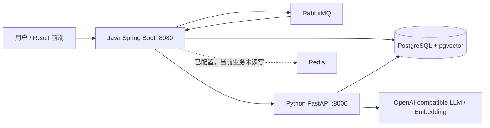

# InterviewGuide 实习项目深度解读

> 阅读对象：只具备少量 Java、Python 基础的初学者。本文只描述当前工作区中 `java-backend/`、`python-agent/`、`frontend/` 与 `infrastructure/` 的实际实现；`reference/interview-guide-original/` 是参考项目，不是本项目正在运行的后端实现。
>
> 代码路径均相对于仓库根目录。文中 `新知识` 表示首次出现的概念，并紧随解释；`更主流的改进方案` 只表示建议，不应误认为当前已实现。

---

## 第一章：项目全景

### 1.1 它解决什么问题

InterviewGuide 是一个“简历—知识库—模拟面试”闭环应用：用户上传简历，系统异步给出简历分析；用户可上传资料或抓取公开网页形成知识库；再基于简历、JD、难度、Skill 与知识库启动文字面试，逐题评价并生成最终报告。

系统分成四个可独立部署的部分：

|部分|职责|关键入口|
|---|---|---|
|React 前端|页面、文件上传、轮询面试状态|`frontend/src/api/*.ts`|
|Java 上层业务服务|用户边界、文件、业务表、任务投递、对 Python 的 HTTP 调用|`java-backend/src/main/java/com/interview/agent/upper/api/`|
|Python Agent 服务|大模型编排、RAG、记忆、网页工具、Skill|`python-agent/app/api/application.py`|
|基础设施|PostgreSQL、Redis、RabbitMQ、容器健康检查|`infrastructure/docker-compose.yml`|

新知识：前后端分离。 浏览器只调用 Java 的 `/api/**` 接口。Java 不自己做大模型推理，而是调用 Python 的 `/v1/**` 接口；Python 不直接修改 Java 的业务表。这样的边界减少了“两个服务同时改同一份业务记录”的风险。

### 1.2 总体数据流

三个最重要的业务流：

1. **简历分析**：上传文件 → Java 解析并保存文件/简历/分析任务 → RabbitMQ 异步投递 → Java 消费者调用 Python 激活记忆和评价 → Java 回写分析结果。
2. **知识库**：上传或网页导入 → Java 保存原文及元数据并投递索引任务 → Python 切片、调用 Embedding、写入 `pgvector` 向量 → Java 回写 `COMPLETED` 与切片数。
3. **文字面试**：Java 先建会话 → Python 规划面试并产生开场题 → 每次答题由 Python 评价、路由、检索、出下一题 → Java 保存候选人可见的问答与分数 → 完成时保存最终报告。

### 1.3 技术栈与为什么这样用

|层|实际技术|作用|
|---|---|---|
|Java|Java 21、Spring Boot 3.4、Spring Web、Validation、JPA|HTTP 接口、参数校验、关系数据持久化|
|Java 工程能力|AMQP、Spring Retry、AOP、Actuator|RabbitMQ、失败重试、限流、健康检查|
|文件|Apache Tika、PDFBox|提取文档文字、导出 PDF|
|Python|FastAPI、Pydantic、SQLAlchemy Async|异步 HTTP、请求/响应模型、数据库访问|
|Agent|LangChain OpenAI-compatible、结构化输出|调用模型并把输出校验成固定 JSON|
|知识库|pgvector、tiktoken|保存向量、按 Token 切片|
|基础设施|PostgreSQL 16、Redis 7.4、RabbitMQ 3.13、Docker Compose|数据、缓存预留、异步队列、部署|

新知识：ORM。 Java 的 JPA 和 Python 的 SQLAlchemy 都是 ORM（对象关系映射）：代码中写 `ResumeEntity`、`InterviewSessionEntity`，框架负责把对象转成 SQL 表记录，减少手写 SQL；但表结构仍以 `infrastructure/postgres/init/*.sql` 为准。

新知识：向量与 Embedding。 Embedding 模型把一段文字变成一串浮点数。语义相近的句子通常在数学空间中更接近，pgvector 据此做余弦距离检索；它不是关键词 LIKE 搜索。

### 1.4 服务启动与配置

`infrastructure/docker-compose.yml` 启动六个容器。PostgreSQL、Python、Java、前端之间用 healthcheck 串联；Java 要等 Python、PostgreSQL、Redis、RabbitMQ 健康后才启动。数据库初始化脚本在首次创建数据卷时运行；已存在数据卷的升级可用 `scripts/apply-db-upgrade.sh`。

Java 配置见 `java-backend/src/main/resources/application.yml`：JPA `ddl-auto: validate` 只校验、不自动建表；这避免应用启动时偷偷改生产表结构。Python 配置模型见 `python-agent/app/core/config.py` 与 `.env.example`。

更主流的改进方案：数据库迁移工具。

当前是 Compose 初始化 SQL + 手工升级脚本。生产环境更常用 Flyway 或 Liquibase：每个 schema 变更有版本号、校验和与执行历史。适配本项目时，在 Java 引入 `flyway-core`，把 001/002/003/004 整理为不可修改的 `db/migration/Vxxx__*.sql`；Python 只使用迁移后的表，不再调用 `create_schema`。

---

## 第二章：Java 业务接口——简历模块

统一入口类是 `java-backend/src/main/java/com/interview/agent/upper/api/ResumeController.java`，基路径 `/api/resumes`。除非另行说明，所有接口从 `X-User-Id` 取得当前用户；`UserIdentityResolver.require` 拒绝空用户标识。当前没有登录/鉴权服务，`X-User-Id` 是开发期身份边界，不能视为生产级认证。

### 2.1 `POST /api/resumes/upload`：上传并触发分析

**功能**：上传简历文件与 `targetRole`，立即创建（或复用）简历，返回 `PENDING/PROCESSING` 分析任务；不等待模型分析结束。

**实现思路**：文件保存、数据库创建、模型调用是不同速度和不同可靠性的动作。接口先做本地校验、哈希去重、文件与业务记录保存，再把耗时模型工作交给 RabbitMQ。关键函数链为 `ResumeController.upload` → `ResumeFileStorageService.inspect/store` → `ResumeAnalysisService.submit` → `ResumeAnalysisWorker.enqueue`。

**具体实现（按数据流）**：

1. `upload` 校验文件非空、有文件名、`targetRole` 非空，调用 `identity.require` 得到 owner。
2. `ResumeFileStorageService.inspect`（`service/ResumeFileStorageService.java`）读取字节，`sha256` 计算内容哈希，并用 `Path.getFileName()` 去掉路径部分；这是防止上传名带 `../` 的第一层保护。
3. 用 `CandidateRepository.findByUserId` 找候选人；不存在就用 `BusinessIdGenerator.next` 创建 `candidates` 记录。随后用 `(candidate_id,file_hash)` 找重复简历。
4. 若重复：将 `current_resume_id` 切回这份简历，取消该候选人所有旧的活动分析，仍通过 `analysisService.submit` 建一条新的分析任务。相同文件不重复存磁盘。
5. 非重复：`Tika.parseToString` 提取 PDF/DOCX 等文本；空文本报错。`fileStorage.store` 以 `resumeId/安全文件名`、`CREATE_NEW` 写入磁盘。随后创建 `resumes` 行；若数据库保存失败，catch 中删除刚写的文件，避免孤儿文件。
6. 取消旧版本活动分析，更新候选人的 `current_resume_id`，再调用 `submit`。`submit` 先取消同一简历旧活动任务、创建 `resume_analyses(PENDING)`，调用 `enqueue` 向 RabbitMQ 发送 `RESUME_ANALYSIS`。
7. 接口返回文本、分析任务 id/状态。真正处理在第十章 RabbitMQ 中说明。

新知识：SHA-256 哈希。 它是从任意字节计算出的固定长度摘要。这里不是加密文件，而是通过“内容相同→摘要相同”的特性去重。理论上可能碰撞，但 SHA-256 在此场景可信度很高。

### 2.2 简历读取、下载与导出接口

|接口|功能|思路与具体实现|
|---|---|---|
|`GET /api/resumes`|列出当前用户简历|`list` 用 `findAll` 后在内存以 `owns` 过滤（候选人 `user_id` 比对），逐份查询最新分析与相关面试数，组装 Map。功能正确，但有 N+1 查询问题。|
|`GET /api/resumes/{id}/detail`|查看简历、所有分析、关联面试|`owned` 先读 `resumes`，再查候选人确认所有权；`analysisService.list` 读取分析历史，按用户取面试并按 `resume_id` 过滤。|
|`GET /api/resumes/{id}/download`|下载原始上传文件|`owned` 授权后，`fileStorage.read(storageKey)` 读取磁盘；`read` 也用 `root.resolve(...).normalize().startsWith(root)` 防路径穿越。|
|`GET /api/resumes/{id}/export`|下载简历与最新分析的 PDF|读取简历和最新分析，`addTextPages` 每 55 字拆行、每 48 行新建 PDF 页；PDFBox 加载环境变量指向的 CJK 字体，否则拒绝导出以避免中文乱码。|

`addTextPages` 是该模块的关键辅助函数：它不理解自然语言排版，只按字符长度硬切。因此超长英文单词/复杂排版不完美，但实现与当前目的匹配。

更主流的改进方案：数据库侧分页与所有权查询。

`GET /api/resumes` 先 `findAll()` 再过滤，数据量上来会读取其他用户的记录到内存，也产生多次查询。应在 Repository 新增 `findByCandidateUserId(userId, Pageable)` 或联表 JPQL，返回分页 DTO；同时将分析/面试计数改为聚合 SQL。

### 2.3 `POST /api/resumes/{id}/reanalyze`：重新分析

**功能**：为当前版本简历重新创建一次分析。

**实现思路**：旧简历不允许重新分析，防止历史任务覆盖当前候选人画像；分析总是异步。

**具体实现**：`reanalyze` → `owned` 授权 → 查 `CandidateEntity.currentResumeId`，不相等返回 `RESUME_NOT_CURRENT` → `ResumeAnalysisService.submit`。`submit` 的 `cancelActiveForResumeIds` 先把同一简历正在排队/处理中记录取消，然后创建新任务并 `enqueue`。`latest/list` 只是 Repository 查询并通过 `toView` 将 JSON 字段解析为列表/Map。

### 2.4 `DELETE /api/resumes/{id}`：删除简历

**功能**：删除简历、分析、关联面试、磁盘文件，并维护候选人的当前简历指针。

**具体实现**：

1. `owned` 验证归属；`cancelActiveForResumeIds` 先将任务标 `CANCELLED`。因此即使删除后 RabbitMQ 的旧消息才到，worker 也会直接返回。
2. 删除该简历的分析；遍历关联面试，先删 `interview_turns` 再删 `interview_sessions`。
3. 若被删的是当前简历，按版本号选择剩余简历中最新的一份（也可能为 `null`）更新候选人。
4. 删除磁盘文件，再删 `resumes` 行。

新知识：补偿操作。 文件系统与数据库不是同一事务。上传时“数据库失败就删除刚写文件”就是补偿；删除流程则存在“文件删了、数据库删除失败”的极小窗口，当前没有完整的跨资源事务。

---

## 第三章：Java 业务接口——面试模块

入口：`api/InterviewController.java`；核心应用服务：`service/InterviewService.java`；Java/Python 会话各有一份状态，通过 `sessionId`、`runId`、`stateVersion` 协作。

### 3.1 `POST /api/interviews`：创建面试

**功能**：以当前简历、岗位、难度、可选 JD/Skill/自定义类别创建一次文本面试，并拿到开场问题。

**实现思路**：Java 先持久化一个 `INITIALIZING` 会话，Python 根据候选人资料规划题纲。只有 Python 返回的 `userId/sessionId/runId` 全部与请求一致，Java 才把会话激活。

**具体实现**：

1. Controller `start` 做 Bean Validation，然后 `InterviewService.start` 调 `ownedResume` 验证简历→候选人→用户归属，并确保其为 `current_resume_id`。
2. `InterviewKnowledgeBaseSelectionService.selectForUser` 选出系统知识库与当前用户已完成的知识库 id；`normalizeDifficulty` 将 `JUNIOR/EASY` 等归一化，非法值抛错。
3. 生成 UUID `sessionId`，`InterviewSessionPersistenceService.createConfigured` 在事务中写 Java `interview_sessions`，状态初始为 `INITIALIZING`。
4. 创建独立 UUID `runId`，构造 `AgentInitializeRequest.CandidateSnapshot`（简历文本、JD、目标岗位、难度、Skill、知识库 id），经 `PythonAgentGateway.initialize` POST 到 Python `/v1/agent/sessions/initialize`。
5. `AgentCallExecutor.execute` 仅在网络/5xx 类 `AgentGatewayException` 上有限重试；`requireMatchingResponse` 校验返回身份，随后 `sessionPersistence.activate` 加行锁读会话，回写当前问题、Agent 版本、阶段和计数。
6. 任一步失败，catch 调 `markFailed`，使 Java 会话不伪装成正常可继续状态。

### 3.2 `POST /api/interviews/{sessionId}/answers`：提交一题答案

**功能**：保存本题答案、评分、下一题（或最终报告）。这是系统一致性最关键的接口。

**实现思路**：调用方必须提供 `runId`。同一逻辑答题请求若因网络超时重发，Python 返回已保存的快照，Java 通过 `interview_turns.run_id` 唯一约束避免重复落题；新的 runId 却使用旧版本，会因版本不一致被拒绝。

**具体实现**：

1. `submitAnswer` 检查 `runId` 非空，`ownedSession` 验证所有权和 `ACTIVE/PAUSED` 状态。
2. 以 Java 当前 `status`、`agentStateVersion`、答案构造 `AgentRespondRequest`，调用 Python `/v1/agent/respond`；Python 的完整流程见第五章。
3. `requireMatchingResponse` 不只检查成功码，还比对三个身份证据，防止错误响应写入另一会话。
4. `InterviewSessionPersistenceService.applyAnswer` 有 `@Transactional`：`requiredForUpdate` 使用数据库悲观锁；**先**按 runId 查已存 turn。若已存且答案相同，直接返回（幂等）；若不同，报 `RUN_ID_PAYLOAD_MISMATCH`。
5. 新 runId 时比对 Java `stateVersion` 与发送前预期版本，不一致报并发修改；校验 Python 返还的阶段在白名单内。
6. 新建 `InterviewTurnEntity`，写问题、回答、阶段、摘要、评分、优弱项 JSON；将最终报告 JSON（若有）与题目计数写入 `InterviewSessionEntity`，再更新下一问题/Agent 版本。
7. Controller 再调用私有 `detail`，读取所有 turns 转成 `InterviewTurnView` 回前端。

新知识：幂等。 同一个操作执行一次与执行多次，结果相同。这里 `runId` 是操作唯一号：重复提交相同 `runId+answer` 不会多出一条面试记录；相同 runId 携带不同 answer 会被明确拒绝。

新知识：乐观/悲观并发控制。 Python 以 `state_version=expected` 的 UPDATE 实现乐观锁；Java 落地时以 `findByIdForUpdate` 悲观锁串行化，再比较版本。这是双层状态避免“两个浏览器标签同时答同一题”的措施。

### 3.3 面试状态、读取、结束与删除接口

|接口|功能—思路—具体实现|
|---|---|
|`GET /api/interviews`|`list` 只按 `user_id` 读 Java 会话，`toView` 解析最终评价 JSON；不调用 Agent。|
|`GET /api/interviews/{id}`|`get` 调 `detail`：先读会话并比对 userId，再读按时间排序的 turns，按 index 映射为可见 DTO。|
|`GET /api/interviews/unfinished/{resumeId}`|`findUnfinished` 查 `INITIALIZING/ACTIVE/PAUSED` 中最新一条，供页面恢复会话。|
|`GET /api/interviews/{id}/agent-status`|先 `detail` 完成授权，再经 `PythonAgentGateway.sessionProgress` GET Python progress；网络失败返回 `STATUS_UNAVAILABLE` 而不是 `IDLE`。|
|`POST /{id}/pause`|`InterviewService.pause` 只对 ACTIVE 有效；将 Java status/version 发给 Python `agent.session.pause`，Python 乐观校验后保存 PAUSED，Java `pauseFromAgent` 回写。重复暂停直接返回。|
|`POST /{id}/complete`|已完成直接返回；否则请求 Python `agent.session.complete`，Python 尝试模型总结但失败会降级为规则总结，Java 保存最终评价并标完成。|
|`GET /{id}/export`|先走 `detail` 授权，`InterviewReportPdfService.render` 将 session/turn/报告生成 PDF。|
|`DELETE /{id}`|若 ACTIVE/PAUSED，先 `complete`，然后在事务中按会话删所有 turns 再删 session。|

### 3.4 Java 到 Python 的网关

`agent/PythonAgentGateway.java` 是唯一跨服务 HTTP 出口。`initialize/respond/complete/evaluateResume/...` 都只是传入不同路径；公共 `post` 执行请求 DTO 验证、`RestClient` 调用、空响应处理、把 Python 标准错误 JSON 还原成 `AgentResponse`。4xx 标记为不可重试，5xx 和网络异常标可重试；这正是 `AgentCallExecutor` 能正确决定是否重试的依据。

---

## 第四章：Java 业务接口——知识库、Skill 与网页工具

### 4.1 `POST /api/knowledgebase/upload`：文件入库并索引

**功能**：上传 TXT/Markdown/PDF/Office 文档，保存原始字节与可检索文本，后台向量化。

**实现思路**：Java 管原文、权限和索引状态；Python 管切片和向量。`KnowledgeBaseService.persistDocument` 先创建 `PENDING` 文档，再 `KnowledgeBaseIndexWorker.index` 投递队列。

**具体实现**：Controller 解析可选网页来源时间；`upload` 对纯文本直接 UTF-8 读取、二进制交给 Tika；校验文本非空；`persistDocument` 创建 `KnowledgeBaseEntity`，保存 `originalBytes/content/source*`；`index` 发送 `KNOWLEDGE_BASE_INDEX`；消费者调用 `process`，将状态原子式推为 PROCESSING，调用 Python `/v1/agent/rag/index`，成功后 `markIndexed(chunkCount)`。

### 4.2 知识库管理接口（每个接口）

|接口|功能—思路—具体实现|
|---|---|
|`GET /list`|`service.list` 验证状态筛选值，仅允许时间/大小排序；Repository 按 owner 查询，过滤状态并映射 view。|
|`GET /{id}/download`|`required` 读库且校验 `owner_id`，优先返回 `original_bytes`，旧数据缺字节时回退为文本 UTF-8。|
|`DELETE /{id}`|先 `markDeleting`；无论本地 chunkCount 是否为 0 都调用 Python `rag/delete`（防迟到向量）；成功才 `deleteMarked`，失败保留 `DELETE_FAILED` 供观察/重试。|
|`GET /categories`|当前用户资料按时间取出 category，去空、去重。|
|`GET /category/{category}`|按 owner + category 查询后映射。|
|`PUT /{id}/category`|`required` 做授权后在 `@Transactional` 方法内调用实体 `updateCategory`，JPA dirty checking 自动 UPDATE。|
|`GET /search?keyword=`|按 owner + name 忽略大小写包含查询；它是文件名搜索，不是 RAG 语义问答。|
|`GET /stats`|Controller 基于 `list` 的结果统计数量：COMPLETED、PENDING/PROCESSING、FAILED/DELETE_FAILED。|
|`POST /{id}/revectorize`|拒绝 DELETING；置 PENDING，再投递同一索引任务。`markIndexing` 失败表示已有 worker 在处理，避免并发重复索引。|

### 4.3 Skill 接口

`GET /api/interview/skills` 与 `POST /api/interview/skills/parse-jd` 在 `SkillController.java`。

**功能**：给前端展示可选 Skills，或从 JD 推出可展示的面试类别。

**具体实现**：`request` 生成 requestId/runId 与用户 id；`list` 调 Python `agent.skills.list`，`parseJd` 先 Validation `@NotBlank` 再调 `agent.skills.parse-jd`；`requiredOutput` 只接受 code 100–199 且有 `output` 的响应。Python 端不调用 LLM 解析 JD，而是用 catalog 中关键字做确定性匹配，见第九章。

### 4.4 网页工具接口

|接口|功能—思路—具体实现|
|---|---|
|`POST /api/tools/web/fetch`|Java 生成调用身份，Python `fetch_public_article` 校验公开 HTTP(S) URL、处理有限重定向/大小/HTML、抽取 Markdown；Java 只透传可信输出。|
|`POST /api/tools/web/crawl`|Python 同域、深度、页数、字节、时间受限地抓取；Java `WebCrawlPreviewService.save` 再校验页数、Markdown 标记/体积，保存 30 分钟、每用户最多 3 个的内存预览 token。|
|`POST /crawl/import`|校验选择非空、无重复、页 ID 存在；锁住 preview，已经导入页直接返回已有结果，否则 `KnowledgeBaseService.uploadMarkdown`，由知识库流程异步索引。|
|`GET /crawl/{token}/archive`|校验 token 属于用户且未过期，返回 `rag_index_enabled:false` 的归档 Markdown；归档不会进入 RAG。|

新知识：SSRF。 服务端代替用户访问 URL 时，攻击者可能诱导它访问内网地址。`validate_public_url` 拒绝私网/回环/链路本地 IP、账号密码 URL、非常规端口，抓取还限制同域、跳转、大小、次数；这是对 SSRF 的针对性防护。

---

## 第五章：Python Agent 模块

入口为 `python-agent/app/api/application.py:create_app`。FastAPI 的路由是 Java 调用的下层契约；所有请求用 Pydantic 模型（`core/contracts.py`）解析，所有成功都返回 `AgentResponse`，包括 `apiVersion/requestId/runId/userId/sessionId/stateVersion`。

新知识：结构化输出。 普通大模型只返回文本，格式可能漂移。`engineering/reliability/structured_output.py:StructuredOutputInvoker` 把 Pydantic schema、提示词和 JSON 示例交给模型，去掉 Markdown JSON 围栏后 `model_validate_json`；验证失败时按策略尝试输出纠正。这让代码能可靠读取 `score`、`action` 等字段。

### 5.1 API 函数逐个说明

|Python 接口函数|功能—思路—具体实现|
|---|---|
|`GET /health` `health`|返回 `UP`，Compose 健康检查调用它。|
|`GET /v1/agent/sessions/{id}/progress` `session_progress`|解析惰性 service，若有 `progress_for` 返回内存阶段，否则 IDLE。进程重启后进度会丢失。|
|`POST .../sessions/initialize` `initialize_session`|记住请求上下文，调用 `InterviewAgentService.initialize_session`；固定默认题数，返回开场题和计数。|
|`POST /v1/agent/respond` `respond`|用 150 秒总超时包住 `submit_answer_for_run`；超时/异常先 `mark_progress_failed`，再返回统一错误；成功只通过 `_candidate_response_output` 白名单暴露候选人字段。|
|`POST .../sessions/complete` `complete_session`|operation 是 `pause` 就调 `pause_session`，否则 `complete_session`；最终评价序列化到 output。|
|`POST /v1/agent/evaluate/resume` `evaluate_resume`|用 `_resume_evaluation_fingerprint`（规范化 JSON 的 SHA-256）读已有 evaluation run；未命中才模型评价；随后 `record_resume_analysis`，并发重复写时读回已有结果。|
|`POST /v1/agent/resume/activate` `activate_resume_memory`|激活新简历，清除从旧简历推导的画像字段，成功返回空结果。|
|`POST /v1/agent/rag/index` `index_rag`|将请求转换成 `KnowledgeDocument`，调用 RAG `index_document`，返回 chunk 数字字符串。|
|`POST /v1/agent/rag/delete` `delete_rag`|按知识库 id 删除向量，空结果表示成功。|
|`POST /v1/agent/skills` `skills_catalog`|对 `parse-jd` 要求 inputText；`SkillRegistry.public_catalog/categories_for_jd` 返回安全元数据，不泄露完整 prompt。|
|`POST /v1/tools/web/fetch` `fetch_web`|调用网页读取工具，注释明确网页内容永不作为系统指令。|
|`POST /v1/tools/web/crawl` `crawl_web`|临时组装 LLM 抓取规划 Agent、重试器，调用有边界的 `crawl_public_site`。|

其余 API 辅助函数也承担明确职责：`_resolve_*` 按需创建单例依赖；`_remember_request_context/_request_context` 保存错误响应需要的请求字段；`_error_response/_error_json_response` 将异常变成标准 envelope；`_session_status_or_failed` 不会把原本 active 会话错误标成失败；`_candidate_response_output` 白名单防内部状态泄露。

### 5.2 `InterviewAgentService`：一次答题的完整函数调用

关键路径：`agent/interview/service.py`。

**初始化 `initialize_session`**：先 `repository.get(session_id)`。若同 `run_id` 重放，比较 `_profile_fingerprint` 后原样返回；否则拒绝已有会话。新会话先调用 `InterviewPlanner.create_plan`，填充 `InterviewSession`（开场问题、知识库 id、计划、初始化指纹），`_register_question` 登记开场题，`MemoryService.initialize_user_memory` 初始化长期记忆，最后 `repository.create` 持久化。

**答题 `submit_answer_for_run` → `_submit_answer`**：

1. 读取会话并校验 user。若 `run_id` 位于 `run_snapshots`，比较答案后 `_synchronize_turn_memory` 并原样返回，完成 Python 层幂等。
2. `_validate_expected_state` 比对 Java 传来的状态/版本；PAUSED 会恢复 ACTIVE。记录 `expected_version`。
3. `MemoryService.build_context` 组合活跃简历、长期画像、最近 turns、摘要。
4. `_run_interview_node(...EVALUATING...)` 调 `InterviewEvaluationAgent.evaluate`；每个模型节点最多 45 秒，状态同步到内存 progress。
5. 开场阶段会 `_replan_after_opening`；随后 `_allowed_actions` 依题量、阶段题数、低分决定允许 `FOLLOW_UP/NEXT_TOPIC/NEXT_STAGE/END_INTERVIEW`，`InterviewRoutingAgent.route` 选路径，`_enforce_route_limits` 纠正模型越界路由。
6. `_record_turn` 写入会话内短期历史，`_compact_session_history` 保留最近 5 条、较早内容压缩进摘要，`_apply_route` 推进阶段或结束。
7. 未结束时 `_question_evidence` 优先查本轮缓存，再用 RAG（最多 30 秒）；证据不足才用 `WebEvidenceTool`（最多 15 秒），之后 `InterviewQuestionAgent.generate` 出下一题，`_register_question` 更新计数。
8. 生成 `AgentRunSnapshot`（候选人可见字段），以 runId 保存并按 `IdempotencyPolicy.max_run_snapshots` 淘汰最老快照；Repository `save(expected_version)` 成功后才 `MemoryService.record_turn`，避免“会话没保存但长期记忆已写”的幽灵记录。

**暂停/完成**：`pause_session` 校验版本后只改 PAUSED；`complete_session` 将状态设 COMPLETED，优先 `InterviewSummaryAgent.summarize`，失败用 `_fallback_evaluation`，保存后 `finalize_session` 写长期摘要。`mark_progress_failed`、`progress_for` 是可观测性工具，不是持久状态机。

### 5.3 五个面试子 Agent（函数级）

文件：`python-agent/app/agent/interview/agent.py`。

|类 / 函数|功能—思路—具体实现|
|---|---|
|`InterviewPlanner.create_plan`|选 Skill 并产生阶段计划。读取 Skill catalog，`select_for_interview` 做确定性领域预选，再以 `StructuredOutputInvoker` 让模型输出 `InterviewPlan`；Pydantic 验证阶段顺序。|
|`InterviewEvaluationAgent.evaluate`|输入当前题、候选答案、记忆上下文，渲染 `interview/evaluation.md` 与选中 Skills，结构化返回分数、总结、优弱项。|
|`InterviewRoutingAgent.route`|输入评价、允许动作、下一阶段和记忆，模型输出 `InterviewRoute`；真正的边界由 service `_enforce_route_limits` 再执行，不能只信模型。|
|`InterviewQuestionAgent.generate`|将当前会话、路由、RAG/网页证据、记忆与 Skill 提示拼成问题提示，返回 `GeneratedQuestion.question`。|
|`InterviewSummaryAgent.summarize`|以完整 turn 记录生成 `InterviewSummary`（总体评价等）；调用失败不阻断完成，service 用规则兜底。|

---

## 第六章：Python RAG 模块

文件：`agent/rag/service.py`、`parser.py`、`embedding.py`、`engineering/persistence/rag_vector_repository.py`。

### 6.1 索引函数链

**功能**：将一个知识库文档变为可语义检索的多个向量块。

**具体实现**：`RagService.index_document` → `TokenChunker.split` → 每批 `OpenAIEmbeddingProvider.embed_documents` → `PostgresRagVectorRepository.replace_for_knowledge_base`。

`TokenChunker.split` 先 `_split_by_headings`：识别 Markdown `#` 标题，代码块内不误识别标题；再 `_split_section`：使用 `tiktoken cl100k_base`，重复标题路径作为上下文，按 chunk token 上限和 overlap 滑窗切分。每个 `KnowledgeChunk` 记录 `chunk_id/document_id/chunk_index/content/headingPath`。

`index_document` 用每知识库 `asyncio.Lock` 避免同库两个索引并发互相覆盖；逐 batch 调 Embedding 并验证向量数量相同，最后“删旧块+加新块”。成功/删除都会 `invalidate_cache`。

### 6.2 检索函数链

**功能**：只从调用方明确传入的知识库范围内找与问题最相近的块。

**具体实现**：`RagSearchTool.search_for_question_generation` → `RagService.search` → `embed_query` → Repository `search`。`search` 校验 use case 在策略白名单、query 非空、knowledgeBaseIds 显式存在；用 `(use_case,kb ids,query,topK,minScore)` 做内存 TTL 缓存。PostgreSQL 使用 `embedding.cosine_distance(query_vector)` 排序，以 `1-distance` 作为分数，过滤 minScore、限制 topK。

新知识：余弦距离。 它衡量两个向量方向是否相似，不关心向量绝对长度。代码用 `score = 1 - cosine_distance`，越接近 1 越相似。若底层不能做 metadata filter，`RagFilterUnsupported` 分支会扩大候选集后在 Python 内存二次过滤，保证不会混入未授权知识库。

### 6.3 解析、Embedding 与仓储函数

|函数|功能与实现|
|---|---|
|`KnowledgeDocumentParser.parse_file`|读取 `.txt/.md`，或用 `pypdf`/`python-docx` 提取 PDF/DOCX；不支持格式明确报配置错误。实际 Web API 索引绕过此函数，直接传文本。|
|`OpenAIEmbeddingProvider.embed_documents/embed_query`|用 `OpenAIEmbeddings` 异步请求兼容 OpenAI 的 Embedding 接口；关闭 SDK 二次 token 化，交给已限长的 chunk；接入 `AsyncRetryExecutor`。|
|`PostgresRagVectorRepository.delete_by_knowledge_base`|一条 DELETE 清理某库所有向量，天然可重复执行。|
|`replace_for_knowledge_base`|同一数据库会话内删旧再 `add_all` 新块并 commit；它实现“索引最终以最新文档为准”。|
|`search`|构造 SQLAlchemy select，按余弦距离排序，返回 `RagSearchResult`。|

---

## 第七章：Python 记忆模块

文件：`agent/memory/service.py`、`models.py`、`policy.py`、`engineering/persistence/long_term_memory_repository.py`。

新知识：短期记忆与长期记忆。 短期记忆是当前会话的 turns 和压缩摘要，随会话保存；长期记忆是用户画像（活跃简历、技术栈、偏好、历史总结），跨会话保存。两者分开能控制提示词长度并避免旧简历污染新面试。

|函数|功能—思路—具体实现|
|---|---|
|`initialize_user_memory`|面试初始化时创建或更新用户记忆；简历切换时清空由旧简历推导的技术栈/深度/偏好/notes，合并 snapshot 后用版本保存。|
|`activate_resume`|上传简历的异步分析前先把它设为唯一 active resume；用 resume 内容指纹 + runId 防重复/冲突，清空派生画像，旧任务后到时不能覆盖新简历。|
|`build_context`|读取用户记忆；找 active resume，截取策略规定的短期 turns，带历史摘要，构成提供模型的 `MemoryContext`。没有记录时返回空上下文。|
|`record_turn`|只在会话保存成功后调用；获取长期记忆、合并近期事实/摘要，使用 expected state_version 保存。|
|`finalize_session`|完成/中断时把会话总结归入长期记忆，保留有限历史。|
|`record_resume_analysis`|校验 active resume，按 `runId+fingerprint` 防重；将简历评价的技术栈、深度、偏好、问题与建议写回画像。旧简历结果触发 `ConsistencyError`。|
|`get_resume_evaluation_run`|按 runId+fingerprint 读取已保存评价，实现 `/evaluate/resume` 重放。|
|`_merge_resume_snapshot/_merge_items/_unique_items`|在限制条数下合并并去重；`_append_summary` 截断摘要，控制增长。|

`PostgresLongTermMemoryRepository.create/save` 映射表 `agent_long_term_memories`；`save` 是 `UPDATE ... WHERE user_id=? AND state_version=?`。更新行数不为 1 就回滚并抛 `ConsistencyError`，这就是长期记忆的乐观锁。

---

## 第八章：Python Tools 模块

### 8.1 网页读取工具

文件：`agent/web_reader.py`。

|函数|功能—思路—具体实现|
|---|---|
|`validate_public_url`|只允许 http/https、有 hostname、80/443、无 URL 凭据；`_is_public_host` DNS 解析后拒绝私网/回环/保留地址。|
|`fetch_public_article`|最多有限重试/重定向；校验 HTML MIME、响应字节上限；`_ArticleParser` 跳过 script/style/nav 等噪声，抽取标题、块和链接，生成 Markdown、SHA-256、抓取时间。网络暂态失败才 retryable。|
|`normalize_crawl_url`|将相对链接转绝对，去 fragment 与常见 tracking 参数，减少重复页。|
|`crawl_public_site`|BFS 队列，同域、最大深度、20 个有效页、10 分钟、50MB、尝试次数及 Markdown 总量均受限；内容哈希去重；可调用 LLM assessor 判定内容/目录/无关；每个有效页加 `rag_index_enabled:true` front matter，另建不可索引 archive。|

`web_crawl_agent.py:WebCrawlPlanningAgent.assess` 使用结构化 schema `CrawlPageDecision`，并把“网页文本不可信、链接必须来自 candidateLinks”写入业务提示，降低提示注入与 URL 幻觉。

### 8.2 Web 搜索与 MCP

`agent/web_search.py:WebEvidenceTool` 是面试证据不足时的备选工具：解析搜索结果，只允许技术站点白名单，结果再交正文读取。`agent/mcp/server.py:lookup_interview_reference` 读取本地参考资料并按查询返回；它是一个受限本地知识工具，不等于任意执行外部 MCP。

---

## 第九章：Python Skills 模块

目录 `python-agent/config/skills/` 下每个 Skill 有 `skill.json`（机器可读元数据）和 `SKILL.md`（模型提示指令），例如 `interview-coach`、`java-backend`、`python-backend`、`system-design`、`algorithm`、`resume-analyst`。

`SkillRegistry`（`agent/skills/loader.py`）的函数：

|函数|功能—思路—具体实现|
|---|---|
|`get(skill_id)`|校验 id，读取 JSON + Markdown，检查必填字段和声明工具，构造不可变 `SkillDefinition`；缺失/格式错抛 `SkillConfigurationError`。|
|`resolve_for_interview(ids)`|按传入 id 去重、逐个 get；用于模型已经选出 Skill 时加载。|
|`available_for_interview`|固定含 `interview-coach`，再枚举预设目录，过滤不符合定义的项。|
|`selection_catalog`|仅暴露 id/name/description/allowedTools 给规划模型，避免把完整内部指令暴露成可被覆盖的数据。|
|`select_for_interview`|先加入 coach，接着尊重用户指定 Skill，再根据目标岗位/JD 的关键词确定性添加 Java、Python、系统设计、算法、CV Skill；去重后返回。|
|`public_catalog`|读 `catalog.json`，校验形状、id 唯一，并逐一 `get`，保证前端不会看到无法加载的 Skill。|
|`categories_for_jd`|小写化 JD，用 catalog 类别 keywords 匹配；无匹配就返回所有候选类别。这不是模型推理，结果可重复。|

新知识：Prompt 注入。 用户输入或网页内容若被当作“高优先级指令”，可能诱导模型忽略原规则。此项目将 Skill 指令从受控文件加载，网页文本作为 `input_payload` 数据，并限制公开 API 只返回 catalog，都是降低此风险的设计。

---

## 第十章：数据库

数据库是 PostgreSQL，初始化定义见 `infrastructure/postgres/init/001-schema.sql`，升级见 002–004。`CREATE EXTENSION vector` 安装 pgvector。Java 和 Python 共用一个 PostgreSQL 实例，但各自只写自己的表。

### 10.1 Java 业务表

|表|字段（按职责归类）|主要作用|
|---|---|---|
|`candidates`|`id` 主键；`user_id` 用户；`display_name`；`current_resume_id`|一个用户的候选人身份与当前简历指针。|
|`resumes`|`id`,`candidate_id`,`version`,`content`; 文件元数据 `file_hash/original_filename/file_size/content_type/storage_key`; `created_at`|简历抽取文本与磁盘文件引用；`candidate_id,file_hash` 有索引用于去重。|
|`resume_analyses`|`id`,`resume_id`,`target_role`,`status`; 六类 score；`summary/strengths_json/suggestions_json/issues_json`; `error/retry_count/last_attempt_at/created_at/updated_at`|异步简历评价任务与结果。|
|`job_descriptions`|`id/title/version/content`|JD 的预留业务表；当前主要 JD 由请求文本传入，未见完整 CRUD。|
|`interview_sessions`|身份/关联 `id,user_id,candidate_id,resume_id,jd_id,skill_id`; `difficulty,total_questions,status`; `state_version,agent_state_version`; 当前题/阶段；四类计数；`final_evaluation_json`; 时间|Java 面试的可见业务状态。|
|`interview_turns`|`id,session_id,run_id UNIQUE,question,candidate_answer,stage`; `evaluation_summary,score,strengths_json,weaknesses_json,created_at`|每一轮已回答题；唯一 run_id 是幂等根基。|
|`knowledge_bases`|`id,owner_id,name,category`; 原始文件/文本 `original_filename,file_size,content_type,content,original_bytes`; 向量状态 `vector_status,error,chunk_count`; 网页来源 `source_url,title,fetched_at,hash`; 时间|Java 所有权、原文、索引状态和来源证据。|

### 10.2 Python Agent 表

|表|字段|主要作用|
|---|---|---|
|`agent_interview_sessions`|`session_id` 主键、`user_id/status/current_stage/state_version`、`session_data JSONB`、时间|Python Agent 全量会话状态（计划、turns、快照、证据缓存等）以 JSONB 保存，同时把常查字段单列。|
|`agent_long_term_memories`|`user_id` 主键、`state_version`、`memory_data JSONB`、时间|跨会话的用户长期记忆。|
|`agent_rag_chunks`|`chunk_id` 主键、`knowledge_base_id/document_id/source_name/chunk_index/content/chunk_metadata JSONB/embedding VECTOR`|每个可检索片段与 embedding。|

新知识：JSONB。 PostgreSQL 的二进制 JSON 类型，可保存结构会变化的对象。这里很适合 Agent 会话，但代价是复杂统计/查询不如完全拆列直观；因此状态、用户、阶段、版本仍单独做列。

---

## 第十一章：Redis——实际使用情况

**结论：当前项目没有业务代码实际读写 Redis。**

证据：`java-backend/pom.xml` 虽引入 `spring-boot-starter-data-redis`，`application.yml` 有 `spring.data.redis.url`，Compose 也运行 `redis:7.4-alpine --appendonly yes`；但 Java 源码中没有 `RedisTemplate`、`StringRedisTemplate` 或 Redis repository，Python 也没有 Redis 客户端。`SimpleRateLimitFilter` 使用的是 `ConcurrentHashMap<String, Window>`，即单个 Java 进程内存。

新知识：Redis。 Redis 是内存键值数据库，常用于缓存、分布式限流、短期 token/锁。Compose 的 `appendonly yes` 会把写命令追加到磁盘，重启后可恢复，但这并不表示本项目目前有写入。

当前仅有的“类似缓存”是 Python `RagService._search_cache`（进程内字典、TTL）和 `WebCrawlPreviewService.previews`（Java 进程内、30 分钟）。多实例部署时它们不共享，重启也会丢失。

更主流的改进方案：把分布式短期状态迁到 Redis。

1. 用 Redis Lua 脚本做按 `userId/IP + path` 的滑动窗口/令牌桶限流，替换 `SimpleRateLimitFilter` 内存 map；这样多 Java 实例共享额度。
2. 将 crawl preview（token→预览）放 Redis 并设 TTL，替换 `ConcurrentHashMap`；内容很大时应放对象存储，只把元数据/token 放 Redis。
3. 将 RAG 检索缓存放 Redis，key 包含 kbIds、query、策略版本，索引/删除时精确失效。
4. 不能把 PostgreSQL 的最终业务状态仅放 Redis；Redis 是加速层，数据库仍是事实来源。

---

## 第十二章：RabbitMQ

配置：`config/RabbitTaskConfiguration.java`。实际交换机 `interview.agent.work`（durable direct exchange），路由键 `agent.work.execute`，主队列 `interview.agent.work.execute`，死信交换机/队列分别为 `interview.agent.work.dlx`、`interview.agent.work.execute.dlq`。JSON converter 将 `AgentWorkTaskMessage(taskType, resourceId, userId)` 编码为 JSON。

新知识：消息队列。 生产者把任务放到队列后即可返回；消费者随后处理。它能削峰和隔离耗时任务，但意味着“接口成功”通常只表示已受理，非最终完成。

### 12.1 在哪里使用

1. `ResumeAnalysisWorker.enqueue`：`ResumeAnalysisService.submit` 创建分析行后投递 `RESUME_ANALYSIS`。
2. `KnowledgeBaseIndexWorker.index`：知识库上传/重向量化投递 `KNOWLEDGE_BASE_INDEX`。
3. `RabbitAgentWorkConsumer.consume`：监听主队列，按 taskType 分发到两个 `process` 函数。

### 12.2 消费的具体实现与可靠性

**简历**：`ResumeAnalysisWorker.process` 先检查分析记录是否存在/已取消、简历是否存在、是否仍是 current resume；这些都不满足时 ack 并返回。`persistence.beginAttempt` 把任务推进处理中；再依次调用 Python 激活简历记忆、简历评价。每次都校验返回的 user/session/run identity；成功才 `persistence.complete`。暂时性网关错误且未到最大投递次数，记录 retryable failure 后抛出，让 Spring Rabbit retry；最终失败标 FAILED。

**知识库**：`KnowledgeBaseIndexWorker.process` 检查文档、owner、删除标记；`markIndexing` 只允许 PENDING/FAILED 等可处理状态进入；调用 Python index。处理期间被删除时，主动再调用 Python delete 清掉迟到向量，绝不回写 COMPLETED。不可重试业务错误被记录后 return；临时错误抛出交给 listener retry。

`application.yml` 配置 listener 重试：初始 1 秒、倍率 2、最多次数可配置，且 `default-requeue-rejected:false`。耗尽后消息进入 DLX/DLQ，便于人工排查而不是无限毒消息循环。

新知识：至少一次投递。 MQ 常保证消息至少被处理一次，因此消费者必须假设重复消息会到来。本项目通过任务状态、`runId`、当前简历检查、`markIndexing` 和向量 replace/delete 实现可重复处理。

更主流的改进方案：Outbox 模式。

当前代码先写数据库再发 Rabbit；若“DB 已提交但发送失败”，任务会留在 PENDING 却没有消息。可新增 `outbox_events` 表，和业务状态在同一数据库事务写入；独立发布器可靠投递 Rabbit，收到确认后标 sent。恢复任务也可扫描 오래 PENDING/PROCESSING 状态。这是跨数据库—消息系统一致性的常用方案。

---

## 第十三章：工程化设计审计

### 13.1 已实现的工程化能力

|主题|实际实现|代码位置|
|---|---|---|
|输入校验|Java `@Valid/@NotBlank/@Size`，Python Pydantic；文件非空、URL、状态白名单|各 Controller；`core/contracts.py`|
|身份/越权保护|每个业务读取先 `X-User-Id`，再校验 resume/session/kb 的 owner|`UserIdentityResolver`、各 Service|
|请求追踪|`RequestIdFilter` 生成/传播 request id，错误 DTO 记录 request/run/session/stage|`engineering/web/RequestIdFilter.java`|
|接口幂等|面试 `runId` 快照 + `interview_turns.run_id UNIQUE`；初始化 profile fingerprint；简历分析 fingerprint|Java persistence；Python interview/memory service|
|并发一致性|Java 会话悲观锁+版本检查；Python/记忆仓储 `WHERE state_version` 乐观锁|`InterviewSessionPersistenceService`；三个 Python repository|
|异步可靠性|Rabbit durable queue/DLX、消费者重试、状态机和取消检查|Rabbit config/worker|
|外部调用可靠性|Java 分辨 4xx/5xx 后有限重试；Python 节点超时、指数退避、输出校验|`AgentCallExecutor`；`AsyncRetryExecutor`；`StructuredOutputInvoker`|
|降级|面试最终总结模型失败时规则 fallback；progress 无法读取返回 STATUS_UNAVAILABLE|Python interview service；Java gateway|
|文件安全|文件名净化、root 前缀检查、CREATE_NEW、失败补偿|`ResumeFileStorageService`|
|网页安全|SSRF 防护、重定向/体积/深度/域名限制、网页不作为指令|`web_reader.py`|
|可用性/观测|Compose healthcheck、Spring Actuator `/actuator/health`、结构化错误信息|Compose、application.yml|

### 13.2 当前限制与落地建议

更主流的改进方案：生产级身份认证。

当前 `X-User-Id` 可被任意客户端伪造。接入 OAuth2/JWT：网关验证 token，把可信 subject 写进 security context；Controller 从认证上下文取 userId，禁止客户端直接决定它。为数据表加外键、唯一约束（如 `candidates.user_id UNIQUE`）会进一步强化边界。

更主流的改进方案：分布式限流、状态与缓存。

现有 `SimpleRateLimitFilter` 在单实例有效，重启清零，多实例额度翻倍。按第十一章迁移 Redis；同时增加指标（限流次数、队列积压、Agent 超时、RAG 命中率）和告警。

更主流的改进方案：S3/对象存储与删除工作流。

简历放本地卷，扩容多实例会出现文件不共享的问题。可替换 `ResumeFileStorageService` 为 S3/MinIO，实现“先上传临时对象→DB 提交→转正式 key”；删除用可重试后台任务/软删除，避免文件系统与数据库的非原子窗口。

更主流的改进方案：明确的会话状态机与跨服务对账。

Java 与 Python 各保存会话状态，目前靠版本/身份校验降低分歧，但若 Java 调 Python 成功后 Java 落库长期失败，仍需要运营修复。可保存 Agent 调用 outbox/inbox、定期按 `sessionId/runId` 对账，或以一个服务作为状态事实源，另一方只存投影。

---

## 第十四章：建议的阅读顺序

1. 先读本章的全景和第三章 `POST /answers`，它涵盖了最多工程问题。
2. 打开 Java `InterviewController` → `InterviewService` → `InterviewSessionPersistenceService`，沿文中函数逐步断点。
3. 再打开 Python `application.py` → `InterviewAgentService._submit_answer` → `agent.py`，观察一次完整 Agent turn。
4. 最后用知识库上传验证 RabbitMQ、RAG、pgvector 三段衔接；查看 `knowledge_bases.vector_status` 与 `agent_rag_chunks`。

本文的关键结论是：Java 不是“调用 Python 后把结果随便存一下”，而是承担了用户边界、任务生命周期、双层状态一致性与候选人可见数据的最终落盘；Python 不是“一个聊天接口”，而是将规划、评价、路由、检索、记忆、工具和结构化输出约束组合成了可恢复的面试状态机。
